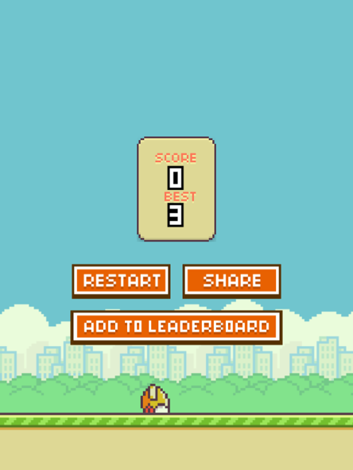
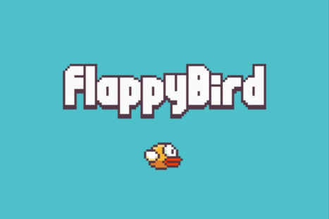
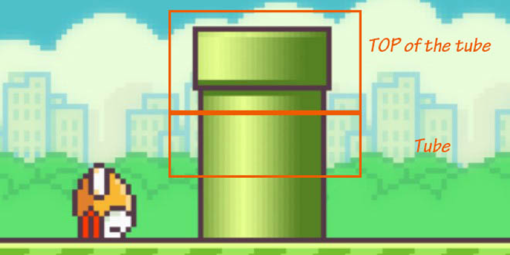

# Multi-Player Flappy Bird
#### IERG3810 Course Project

> This is the course projects of IERG3810 Microcontrollers and Embedded System, which aims to build a light-weighted game based on C programming on a Cortex-M3 system. 

#### I. OBJECTIVES  

Flappy Bird is a popular mobile game released in 2013. The game is based on a 2D side-scrolling map feature. In the game interface, there should be a bird, a map with solid ground and several obstacles. Usually the location of those obstacles is randomly generated.

In this game, player need to click the screen to let the bird fly to avoid the obstacles (in the previous version they are pipes) appear in the map. With each clicking, player can give a “boost” to let the bird fly higher. Once the bird falls to the ground or knock on any objectives, the game is over. In this mini-project, touch screen will be preferred to achieve clicking.  

There are some other features like choosing the difficulty level to that player can find a level that he would like to enjoy. Also, an introduction of the game will be shown in the beginning to simplify the game procedure. Once the bird hits any obstacles, the game will be over and the current score will be displayed on the scoreboard.  

1. **New Features**
  **Multiplayer Mode** : P1 controls the bird, trying to avoid those obstacles. P2 controls
    the position of ‘walls’ (tubes as a matter of fact), trying to let the bird die.  
  **Touch Control:** For P1, he can use **swipe left or right** to let the bird fly towards left and right.  
  **Pause/Resume:** Use interrupt to pause and resume the game.     

2. **Game Manual ** 
    1) At the start page, you shall see the simple game instruction, press ENTER to start.
    2) Once start the game is played by two players.  
    3) Player1 controls the bird by touch, swipe left and right to change the bird’s position.
       His task is to prevent the bird from hitting on the wall.  
    4) Player2 controls the position of wall, he can use “2” and “8” to let the wall goes up and down. His task is to kill the bird.
    5) Once the bird hits on the wall or goes out of boundary, the game is over and score will be shown at the game over page.
    6) Press “Num Lock” to restart the game. Press “KEY2” button to change the game
       speed at any time of the game. Press “KEYUP” to pause the game for 10 seconds.

3. **List of Hardware**
  **LED** : Use LED to indicate the game is paused/ resumed.
  **Button** : Use button (KEY2) to choose the game speed, so that to control the level of difficulty.
  **TFTLCD** : Used as main display for gaming graphical interface.
  **Interrupt** : When clicking on the touch screen, interrupt will be generated. Maybe when restart, we will use some other interrupt to achieve that.
  **Timer** : use SYSTick to control the flying speed, falling speed of bird, the scrolling speed of map, and the display rate of the TFT screen.
  **ADC** : ADC is used to transform the reading parameters of the X and Y positions in the touch screen.
  **Touch Screen** : Player need to click on the touch screen to make the bird flyer higher.

  

#### II. MODEL & VIEW DESIGN

To make the game logic to stay concise and robust, we split the game into two independent part: model and view.  

1. **Model Design**
    In the game model, there are three main elements: background, the bird, and the wall.
    To simplify the first version of our model, we just let the background to be black.

    The bird has three key parameters:    

    * **X position** : X position can be changed by the user or just be a constant.   
    * **Y position** : Y position decreases according to time lapse (falling down).   
    * **Alive / Dead** : The status of the bird can be told by checking if the bird has hit the wall.  

    Because the programming platform is based on C language, which does not offer the advanced data structure like Queue or List, so here we just use a set of array with maximum size n to store the information of the wall: 

    * **WallPass[n]** : For each wall, 1 indicated the wall has not been passed by the bird, 2 indicates the wall has been passed by the bird, and 0 indicates the wall has been out ofthe screen boundary. 
    * **WallX[n]** : The x position of the wall.   
    * **WallY[n]** : The y position of the wall.  

    Noted that n is the maximum number of walls appearing on the screen at the same time. In our program, consider the size of our touch screen, we let n to be 3, which means it can store the information of three walls at the same time.

    **Scroll** : The scroll of map just affects the walls but not the bird, which means the WallX[i] value would be assigned to be 240 at first and then decay with 5 pixels each time the screen refreshes.

    Between model and view, those global parameters need concern: 

    * **Score** : the game score, in relation to the score mechanism. 
    * **Speed** : the game speed, designed to be controlled by the interrupt caused by KEY2. 
    * **GameStatus** : indicate the current game page.

    We define those global variables functions for handling the game logic:  

    '''

    int canStart; // Decide whether to start the game
    int status; // Game status
    int touchXStatus; // Touch Status
    int speed; // Game speed control
    int Number; // Use to count down to zero when started
    int ifBG; // To show if background has been drawn
    char mode[3] = "umd";

    int next; // Used to show the next shape of bird

    int score; // Game score

    int wallX[3];

    int wallY[3];

    int wallPass[3]; // Three set of arrays to store the X position/Y position/enable of wall**

    u16 OldXPosition;
    u16 TsXposition; //TouchScreen x-position
    u16 TsYposition; //TouchScreen y-position
    void GameDataInit() // Initailize the game data

    void AddWall() // Add a set of walls
    void ifAddScore() // Check if the bird has already passed one wall
    void ifFail() // Test if the bird hit the wall or be out of boundary

    '''

2. **View Design**  
    The view of this game includes three pages: the start page, the game page and the game
    over page.  

    In the start page, relevant information about this game will be displayed:  
    **Game Logo** : the flappy bird logo.  
    **Bird** : displaying a flying bird, in fact display pictures of the birds alternatingly to achieve the animation of the “flying” bird.  
    **Instruction Guide** : tell the user how to player the game.  

    Based on the ShowChar() and ShowChiChar() function we used in Lab3, we can print Instruction Guide, Name, SID, and Group Number using the same technique.    

    For the Game Logo and the Bird as pictures, we used the **Image2LCD** software to transform jpeg file into c file containing the positions and colors. For example, for the
    Bird.jpeg we set the output to be 16 bit colored and set the size to be 40 * 20.    

    

    The output is stored in c file like FONT.H can be included in the header.  

    In the game page, we need to display:  
    **Bird** : similar to the start page, we use pictures to simulate the “flying bird”.  
    **Wall** : divided into two parts. (n*Tube + TopOfTube = Wall). 
    **Background** : simply set it to light blue.  

    We split the wall into two parts: the tube and the top of the tube:  

    

    In the Game Over page, we will display:
    **Score** : displayed in our personalized font.
    **Game Info** : guide the player to restart the game.
    **Bird** : similar to the start page, we use pictures to simulate the “flying bird”.

    We define several functions for drawing pictures:

    '''

    void DrawAntiBirdPic( u16 x, u16 y, u8 mode )
    void DrawTube( u16 x, u16 y)
    void DrawTubeTop( u16 x, u16 y)
    void DrawBG()
    void DrawLogo( u16 x, u16 y )
    void DrawNum_Multi( u16 x, u16 y, u32 num, u8 mode )

    '''

    Those draw function are based on the implemented functions in Lab3:

    '''

    void IERG3810_TFTLCD_DrawDot(u16 x,u16 y, u16 color)
    void IERG3810_TFTLCD_FillRectangle(u16 color, u16 start_x, u
    start_y, u16 length_x, u16 length_y)
    IERG3810_TFTLCD_ShowChar(u16 x, u16 y, u8 ascii, u16 color)
    void IERG3810_TFTLCD_ShowChinChar(u16 x, u16 y, u8 ascii,u16 color)

    '''

3. **Program Flow**
    One simple illustration of our program flow is:  

    

#### III. IMPLEMENTATION

In this part, several key components in our code will be illustrated and explained in detail.

1. **Multiple SYSTICKs**
    In our program, multiple SYSTICKs are used for different propose. We define four different HeartBeat in total and used two canBeat parameter to control the start time of two of these HeartBeats.  

    In the main function, task1HeatBeat is set to control the normal program flow, the display part and the game logic part, task2HeatBeat is set to renew the past wall regularly, task3HeartBeat is used to count down from 3 to 0 when game started, and Task4HeatBeat is used for detecting touch motion independently.    

2. **Recognizing Swipe Motion on Touch Screen**
  TouchScreenReadData(int x) can be used to retrieve the data in the touch screen register.  

  '''

  **TsYposition = TouchScreenReadData(1); //read. 
  Y position data from the touchscreen. 
  TsXposition = TouchScreenReadData(5); //read X position data from the touchscreen**. 

  '''

3. **Multiple Player Mode**
  As mentioned in the game manual, our version of flappy bird is designed for multiple players. Player1 controls the bird by touch, swipe left and right to change the bird’s position. His task is to prevent the bird from hitting on the wall. Player2 controls the position of wall, he can use “2” and “8” in the PS2 keyboard to let the wall goes up and down. His task is to kill the bird.  

  Because the PS2 keyboard input can be handled as interrupt, so basically the control of Player is real time. For touch recognition part, we put the detection function into a relatively faster Heart Beat (20 Hz) and let the feedback of touch can be handled within 50ms.  

#### IV. **TESTING, DIFFICULTIES AND SOLUTIONS**

We first test the game start page and the game over page, these two pages works fine.  

Then we move to test the game page with the bird and the walls. We find that the screen has some serious flashinges when we turn the refreshing rate to more than 20 Hz. It seems that the CPU needs some tome to finish all the drawing, the period of drawing causes flashing. We then turned the refreshing rate to a lower number like 10 Hz, this problem can be partially solved but the flashes still have a little remain.  

#### V. SUMMARY

In this mini project, we aim to make use of all the previous components and knowledge and
design our own game: Flappy Bird. As we get our hands on the project, innovative idea comes
one by one. To make use of the PS2 keyboard, we have the idea to turn this single player game into a game with two players. This feature adds more fun to the game and encourage our team to move further.  
Then we add the touch feature to the game. Recognizing simple touch is easy, but it has much more difficulties when handling with different gestures like swipe. We write our own swipe recognition program and tackle this problem finally.  
